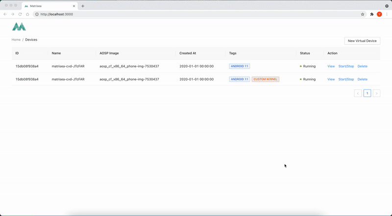
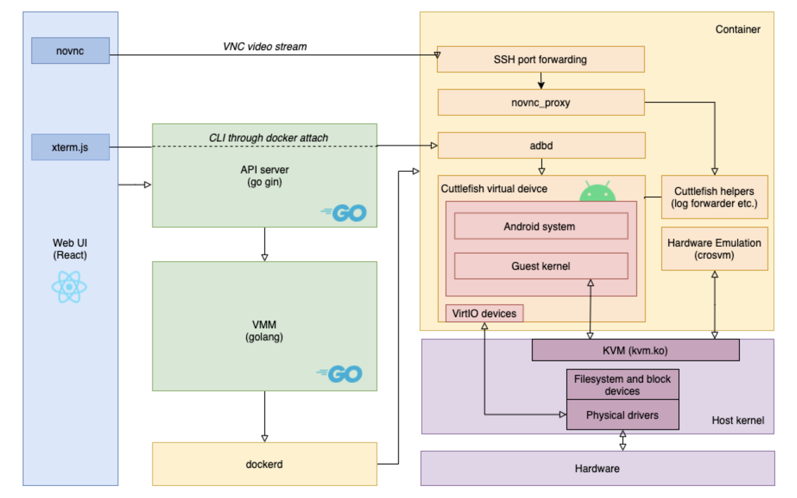

*Disclaimer: This project is still in the pre-alpha and is under active development. Features and functions are expected to break from time to time.*

**Matrisea (/ˈmeɪtrɪksiː/)** is an Android Virtual Device(AVD) orchestrator and cloud reversing platform that provides high-fidelity virtual devices with powerful integrated tools.



## Features

**Device Orchestration**
- Spin up multiple virtual devices in minutes
- Support the latest AOSP (Android 9-12 GSI images) and Android mainline kernel
- Run x86-64/ARM64 devices with native performance through KVM

**High-fidelity Device for Pentester/Security Researchers**
- Matrisea is built on Google's latest [Cuttlefish Virtual Device(CVD) that guarantees full fidelity with Android framework](https://source.android.com/setup/create/cuttlefish)
- Get root, Google Service, ARM CPU, instantly, on a single virtual phone
- *(Coming soon!)* Pick your favourite reversing/research tools (e.g.Frida, adeb, bcc/eBPF) during device creation and use them immediately

**Cloud Reversing Platform for Teams**
- Access everything from the web e.g. remote screen, terminal, files, console/kernel log
- Zero setup time for new members. Create a device and get to work in minutes
  - *(Coming soon!)* Matrisea allows you to create a device template and share with everyone. Customize anything including kernels, AOSP images, cmdline options, and tools

## Quick Start

### System Requirements
- Hardware: Any modern CPUs with virtualization extensions (e.g. Intel VT-x/AMD-V/ARMv7-A and above)*/**
- OS: Debian / Ubuntu 20.04+ (recommended)
- Host Kernel: compiled with `CONFIG_VHOST_VSOCK` and `CONFIG_VHOST_NET`
- Packages: Docker, Golang >= 1.17

> **Notes on KVM and CPU Architectures**
> 
> *\*Matrisea relies on KVM as a hypervisor and KVM requires the guest OS/device to have the same CPU architecture as the host. In other words, if you run Matrisea on a x86-64 host, your virtual device will have a x86/x64 CPU. If you would like to have an ARM powered virtual device, run Matrisea on an ARM host e.g. Raspberry Pi 4 or AWS Ampere A1 instance.*
>
> *\*\*If you plan to run Matrisea in a VM, make sure to configure the host to expose nested virtualization to the guest.*
> - *[ESXi/vSphere - Expose VMware Hardware Assisted Virtualization](https://docs.vmware.com/en/VMware-vSphere/7.0/com.vmware.vsphere.vm_admin.doc/GUID-2A98801C-68E8-47AF-99ED-00C63E4857F6.html)*
> - *[VirtualBox - Nested Virtualization](https://docs.oracle.com/en/virtualization/virtualbox/6.0/admin/nested-virt.html)*

### Running Locally

Matrisea is a web service designed be running on a KVM-enabled Linux server. To build and test Matrisea, the options are
 - Run Matrisea on a bare-metal Debian host
 - Run Matrisea inside of a Debian VM, with nested virtualization option enabled

If you'd like to try Matrisea or run it locally, we recommend to use the provided `docker-compose.yml` for bootstrapping. 

1. Clone the repo and install the required packages. Once finished, reboot to load additional kernel modules.
    ```
    > git clone https://github.com/senyuuri/matrisea
    > sudo ./setup.sh
    
    # After reboot, specify a local path for storing Matrisea's data. The path must be in its full form i.e. without `~`
    > cd matrisea && vi .env
    > docker-compose up
    ```

2. The docker-compose config defaults to use host networks for Matrisea containers. On the host, open the browser and visit `http:\\[your-host-ip]:3000`
3. To download an AOSP image, Go to https://ci.android.com/ and search for the GSI branch ( `aosp-android*-gsi`). Among all the builds, look for a successful build (green box) under the `userdebug - aosp_cf_x86_x64_phone` column. Click `Artifacts` and download the following files:
    - `aosp_cf_x86_64_phone-img-xxxxxxx.zip`
    - `cvd-host_package.tar.gz`

> *For devlopers using VSCode*
> 
> *`gopls` in VSCode can't corretly identify imports for go modules in subfolders. To resolve "cannot find packages" warnings, goto `File > Add folder to workspace` and import folder `api` and `vmm` respectively.*
> *The [issue](https://github.com/golang/go/issues/32394) has been discussed in the community and is currently WIP.*


## Architecture
Matrisea is built on top of a variety of open source technologies.
- Frontend: React, novnc, xterm.js
- Backend: Golang, Gin
- VM: crosvm-backed cuttlefish AVD, KVM
- Orchestration: docker
- Android OS: AOSP GSI images


